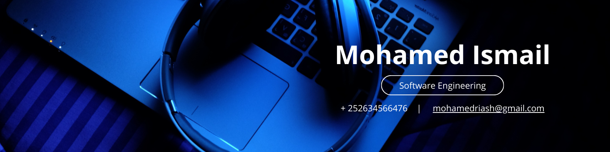

# Hello buddy! 👋🏼, I'm Mohamed, Back‑End Engineer :
**Turning business logic into backend architecture.**
I'm a backend engineer who designs clean, efficient, and reliable systems. I focus on performance, scalability, and maintainability — because great code isn’t just written, it’s engineered.

- 🇸🇴  Based in **Somalia**
- 🤝  Open to AI‑focused open‑source collabs
- 🛜 currently working on my own [Cafe management](https://www.notyet.de)
- 👨🏼‍💻 working as a web developer since 2022
- 🌐  Portfolio → [rirash.com](https://rirash.com)
- ✉️  Reach me → [mohamedriash@gmail.com](mailto:mohamedriash@gmail.com)

  <h2> 🌐 Socials </h2>
  
  
  
  

<picture>
  <source media="(prefers-color-scheme: dark)" srcset="https://raw.githubusercontent.com/Mohamed-Rirash/Mohamed-Rirash/output/github-snake-dark.svg" />
  <source media="(prefers-color-scheme: light)" srcset="https://raw.githubusercontent.com/Mohamed-Rirash/Mohamed-Rirash/output/github-snake.svg" />
  
</picture>

## 💻 Current Tech Stack

  
  
  
  
  
  
  
  
  
  
  
  
  
  
  
  
  
  
  

  
  
  

---
## 🏆 GitHub Trophies

  

---

### 🔝 Top Contributed Repos

  

